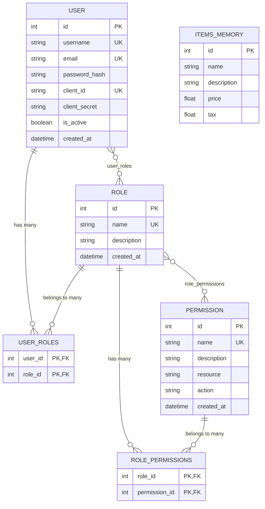

# Database Design - Mermaid Diagram

## Database Schema Overview

### Core Entities

1. **USER**: Stores user account information including OAuth client credentials
   - Primary authentication entity
   - Contains hashed passwords and client secrets for OAuth
   - Tracks user status (active/inactive)

2. **ROLE**: Defines user roles (admin, manager, user)
   - Groups permissions into logical sets
   - Provides role-based access control

3. **PERMISSION**: Granular permissions for specific actions
   - Format: `resource:action` (e.g., `items:read`, `users:write`)
   - Enables fine-grained access control

### Association Tables

4. **USER_ROLES**: Many-to-many relationship between users and roles
   - A user can have multiple roles
   - A role can be assigned to multiple users

5. **ROLE_PERMISSIONS**: Many-to-many relationship between roles and permissions
   - A role can have multiple permissions
   - A permission can belong to multiple roles

### In-Memory Storage

6. **ITEMS_MEMORY**: Items are stored in-memory (not persisted to database)
   - Simple key-value storage using Python dictionary
   - Data is lost when application restarts

## Default Data Structure

### Default Roles
- **admin**: Full access to all resources
- **manager**: Can manage items but not users
- **user**: Basic read access to items

### Default Permissions
- **items:read**: Read items
- **items:write**: Create and update items
- **items:delete**: Delete items
- **users:read**: Read users
- **users:write**: Create and update users
- **users:delete**: Delete users

### Default User
- **Username**: admin
- **Email**: admin@example.com
- **Client ID**: admin_client
- **Client Secret**: admin_secret
- **Role**: admin (with all permissions)

## Security Features

- **Password Hashing**: Uses bcrypt for secure password storage
- **Client Secret Hashing**: OAuth client secrets are also hashed
- **JWT Tokens**: Access tokens expire in 5 minutes
- **Refresh Tokens**: Refresh tokens expire in 7 days
- **Role-Based Access Control**: Permissions are checked via roles
- **Permission-Based Access Control**: Fine-grained permission checking